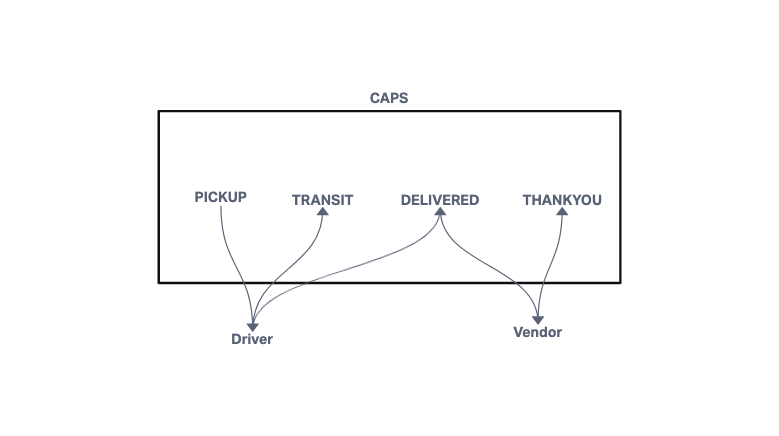
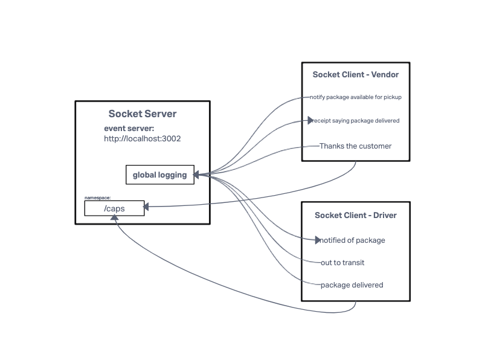
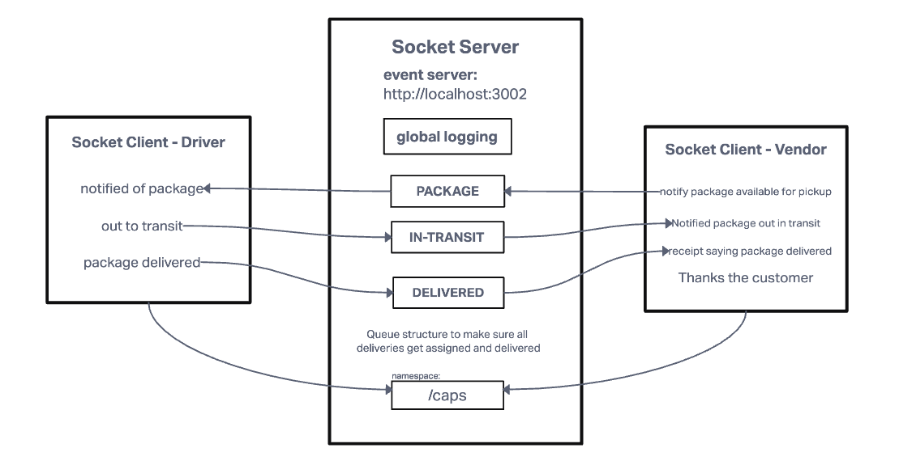

# LAB - Class 11, 12, 13

## Project: CAPS

### Author: KC Hofstetter

### Problem Domain

- In **Phase 1**: Begin the build of an application for a product called CAPS - The Code Academy Parcel Service. In this sprint, we’ll build out a system that emulates a real world supply chain. CAPS will simulate a delivery service where vendors (such a flower shops) will ship products using our delivery service and when our drivers deliver them, each vendor will be notified that their customers received what they purchased.

- This will be an event driven application that “distributes” the responsibility for logging to separate modules, using only events to trigger logging based on activity.

- In **Phase 2**, we’ll be changing the underlying networking implementation of our CAPS system from using node events to using a library called Socket.io so that clients can communicate over a network. Socket.io manages the connection pool for us, making broadcasting much easier to operate, and works well both on the terminal (between servers) and with web clients.

- The core functionality we’ve already built remains the same. The difference in this phase is that we’ll be creating a networking layer. As such, the user stories that speak to application functionality remain unchanged, but our developer story changes to reflect the work needed for refactoring.

- In **Phase 3**, we are building a set of features to help manage deliveries made by CAPS Drivers. This will simulate a delivery driver receiving a list of orders from a Queue and “scanning” package codes on delivery. Retailers will be able to see in their dashboard or log, a list of all packages delivered in real time. Should a delivery driver deliver many packages while the retailer is not connected to the dashboard, the vendor client should be guaranteed to receive “delivery” notifications from the Queue system.

### Links and Resources

- [ci/cd](https://github.com/khofstetter94/caps/pull/1) (GitHub Actions)

### Setup

#### How to initialize/run your application (where applicable)

- (from the server module) node index.js
- (from the vendor module) node index.js
- (from the driver module) node index.js

#### Features / Routes

- As a vendor, I want to “subscribe” to “delivered” notifications so that I know when my packages are delivered.
- As a vendor, I want to “catch up” on any “delivered” notifications that I might have missed so that I can see a complete log.
- As a driver, I want to “subscribe” to “pickup” notifications so that I know what packages to deliver.
- As a driver, I want to “catch up” on any “pickup” notifications I may have missed so that I can deliver everything.
- As a driver, I want a way to “scan” a delivery so that the vendors know when a package has been delivered.

#### UML

- Lab 11

- Lab 12

- Lab 13

